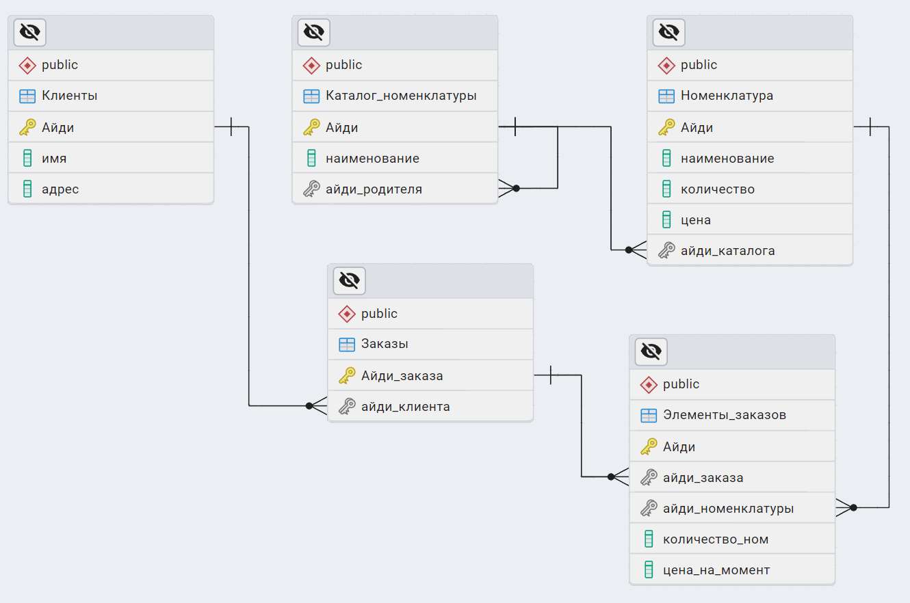

## Пункт 1 Спроектировать схему БД.

## Пункт 2.1 Получение информации о сумме товаров заказанных под каждого клиента (Наименование клиента, сумма)
SELECT K.имя AS Имя_клиента, COALESCE(SUM(EZ.количество_ном * EZ.цена_на_момент), 0) AS Сумма_товаров FROM Клиенты K 
LEFT JOIN Заказы Z ON K.Айди = Z.айди_клиента 
LEFT JOIN Элементы_заказов EZ ON Z.Айди_заказа = EZ.айди_заказа 
GROUP BY K.Айди, K.имя 
ORDER BY Сумма_товаров DESC, Имя_клиента ASC;

## Пункт 2.2 Найти количество дочерних элементов первого уровня вложенности для категорий номенклатуры.
SELECT KN.наименование AS Каталог, COUNT(KN1.Айди) AS Количество_дочерних_элементов FROM Каталог_номенклатуры KN
LEFT JOIN Каталог_номенклатуры KN1 ON KN.Айди = KN1.айди_родителя
GROUP BY KN.Айди, KN.наименование
ORDER BY Количество_дочерних_элементов DESC, KN.наименование ASC;
